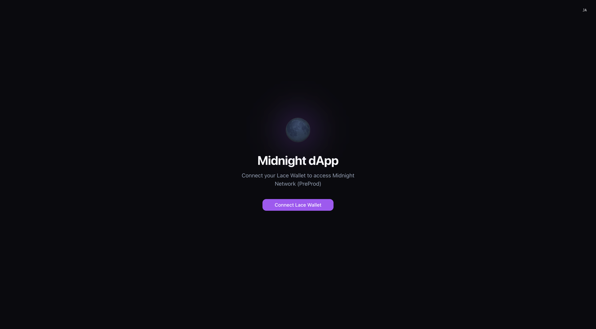
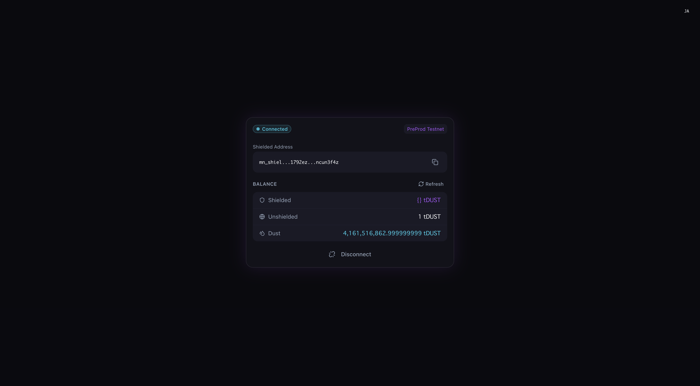

# midnight-lace-react-sample-app

A sample dApp frontend for connecting to the Midnight Network (PreProd).  
Use Lace Wallet to connect your wallet, view your shielded address, and check your balance.

## Screenshots





## Features

| Feature | Description |
|---|---|
| Lace Wallet Connection | Detects and connects to `window.midnight.mnLace` via 100ms polling |
| Version Validation | Verifies that the Connector API version is `>=1.0.0` |
| Network Detection | Automatically tries networks in order: PreProd / mainnet / undeployed / preview |
| Address Display | Shows the shielded address in a copyable format |
| Balance Display | Shows Shielded / Unshielded / Dust balances in tDUST units |
| Language Toggle | Instantly switch between Japanese and English via the top-right button (persisted in localStorage) |

## Tech Stack

| Category | Library / Tool |
|---|---|
| Framework | React 19 + TypeScript |
| Build | Vite 8 |
| Styling | Tailwind CSS v4 (`@tailwindcss/vite`) |
| UI Components | shadcn/ui (Button, Badge, Card) + Lucide React |
| Internationalization | i18next 26 + react-i18next 17 |
| Wallet Integration | `@midnight-ntwrk/dapp-connector-api` |
| Async Processing | RxJS 7 |
| Package Manager | Bun |
| Formatter | Biome |

## Directory Structure

```
src/
├── App.tsx                     # Root component (switches view based on connection state)
├── main.tsx                    # Entry point
├── components/
│   ├── ConnectSection.tsx      # Landing screen shown when not connected
│   ├── AddressCard.tsx         # Wallet info card shown after connection
│   ├── LanguageToggle.tsx      # Fixed language toggle button in the top-right corner
│   └── ui/                    # Base shadcn/ui components
├── contexts/
│   ├── WalletContext.tsx       # Wallet state management provider
│   ├── walletContextDef.ts    # Context type definitions
│   └── useWallet.ts           # useWallet hook
├── hooks/
│   └── useBalance.ts          # Balance fetching hook
├── i18n/
│   ├── index.ts               # i18next initialization (default: Japanese)
│   └── locales/
│       ├── ja.ts              # Japanese translations
│       └── en.ts              # English translations
├── lib/
│   ├── wallet.ts              # Lace connection logic and error classes
│   └── utils.ts               # Tailwind class merging utility
└── utils/
    ├── constants.ts           # Network config, currency units, and other constants
    └── types.ts               # Shared type definitions
```

## Setup

```bash
bun install
bun run dev      # Start development server (http://localhost:5173)
bun run build    # Production build → dist/
bun run preview  # Preview dist/ locally
bun run lint     # Run ESLint
bun run format   # Run Biome formatter
```

## Prerequisites

- [Lace Wallet](https://www.lace.io/) browser extension (Midnight-compatible version) must be installed
- The **PreProd** network must be selected in Lace's settings
- If performing operations that require ZK proofs, start the Proof Server (port 6300)

```bash
# To start the Midnight local infrastructure from the project root
docker compose -f standalone.yml up -d
```

## Environment Variables

No required environment variables at this time.  
Indexer / Node URIs are automatically retrieved from Lace Wallet. If unavailable, the app falls back to `FALLBACK_URIS` (testnet-02) defined in `src/utils/constants.ts`.

